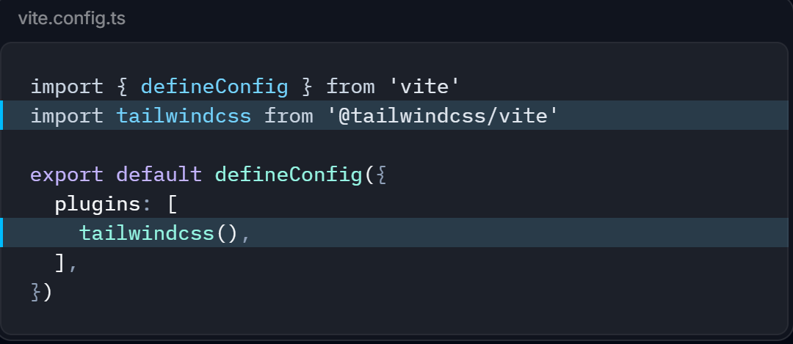
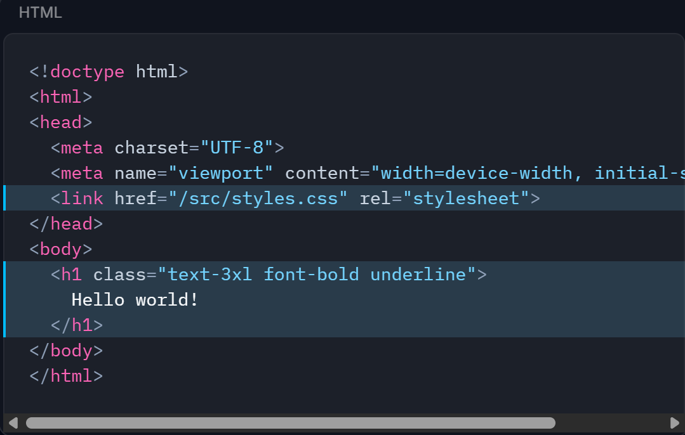

# react + ant design + tailwindcss 
[toc]

## 1. 创建react项目
> pnpm create vite@latest
## 2. 安装ant design 及其icon
> pnpm install antd --save @ant-design/icons@5.x
安装好后直接在tsx中import {...} from 'antd'或'@ant-design/icons' 即可使用组件

> ant design官方文档:https://ant-design.antgroup.com/components/

## 3. 安装tailwindcss
- 第一步
  > pnpm install tailwindcss @tailwindcss/vite postcss@latest autoprefixer@latest
- 第二步
  在vite.config.js中配置
 
- 第三步
  创建一个css文件写入，例如/src/assets/css/tailwind.css
  > @import 'tailwindcss';
- 第四步
  在index.html页面中引入
  
  或者在/src/main.tsx中
  > import "./assets/css/tailwind.css"
- 取消预编译好的重置样式表 base.css
将统一引入
> @import "tailwindcss";
改成逐一引入，并把base.css注释掉
```css
@layer theme, base, components, utilities;
@import "tailwindcss/theme.css" layer(theme);
/* @import "tailwindcss/base.css" layer(base); */
@import "tailwindcss/utilities.css" layer(utilities);
```

> tailwindcss官方文档:https://tailwindcss.com/docs/installation


# others review

## 1. lazy import component
```tsx
import { lazy } from 'react'
 //lazy 是一个函数
 //返回值为一个组件
 //参数为()=>import('path/to/components')
 //特点:lazy的返回的组件不会随第一次请求页面时同步导入
 // 只有当该组件被渲染的时候才会导入
 // 打包时也会对懒加载的组件单独打包
 const LazyComponent = lazy(() => import('./components/HelloWorld'))
```
## 2. lazy import component with suspense
```tsx
import { lazy, Suspense } from 'react'
// Suspense 是一个组件
// 特点:当lazy的组件被渲染时,会先渲染Suspense组件
//       当lazy的组件加载完成时,会渲染lazy的组件
//       当lazy的组件加载完成前,会渲染fallback属性指定的组件
//
// 作用:包裹lazy的组件,当lazy的组件加载完成前,显示loading,
// 用户体验更好
```
```tsx
import type {ComponentType} from "react";
// ComponentType 是一个类型
// 用处:常用于用于断言lazy返回的组件的Props类型
// 用法:
// 0.配合自定义的组件的Props类型传给ComponentType的泛型参数 ->ComponentType<ComponentProps>
// 1.当作泛型,传给lazy的泛型参数  -> lazy<ComponentType<ComponentProps>>
// 或者使用 as 断言 const LazyComponent = lazy(() => import('./components/component.tsx')) as ComponentType<ComponentProps>
// e.g.
type HelloWorldProps = {
    name: string
}
const LazyComponent = lazy<ComponentType<HelloWorldProps>>(() => import('./components/HelloWorld'))
const lazyCompoent2 = lazy(() => import('./components/HelloWorld')) as ComponentType<HelloWorldProps>
// 这样写了之后,lazyCompoent的Props类型就断言成了HelloWorldProps
```
### btw, 为什么要断言？
> 因为懒加载的组件,ts无法进行类型推断,所以需要手动断言

## 3. 批量懒加载
### 问题
我们也许会写出这种代码，封装一个懒加载的函数，传一个字符串,返回一个懒加载的组件
```tsx
function lazyImport(pageName: Page): ComponentType<PageComponentProps> {
  return lazy(() => import(`./pages/${pageName}Page`));
}
```
而不是把所有懒加载组件逐个都写成下面这样，(因为懒,繁琐)
```tsx
const LazyComponent1 = lazy<ComponentType<HelloWorldProps>>(() => import('./components/HelloWorld1'))
const LazyComponent2 = lazy<ComponentType<HelloWorldProps>>(() => import('./components/HelloWorld2'))
const LazyComponent3 = lazy<ComponentType<HelloWorldProps>>(() => import('./components/HelloWorld3'))
```
第一种写法也许在开发环境dev下没有问题，但是生产环境下会产生页面无法加载的情况
第一种写法，书写半动态路径，会导致打包器无法正确进行依赖分析，一般会导致打包器没有对某些页面进行打包
第二种写法直接书写静态的导入路径,打包器能够正确分析依赖

### 解决思路：让打包器认识这样的代码依赖到哪些组件

### 其中一种解决办法
询问ai得知，可以使用import.meta.glob让打包器认识这样的代码依赖到所有./pages/*Page.tsx这样的依赖
```tsx
type Page = "Home"  | "Enroll" | "Manager"| "Order";

const pageComponents = import.meta.glob("./pages/*Page.tsx");
function lazyImport(pageName: Page): ComponentType<PageComponentProps> {
  const componentPath = `./pages/${pageName}Page.tsx`;
  return lazy(pageComponents[componentPath] as () => Promise<{ default: ComponentType }>);
}
```